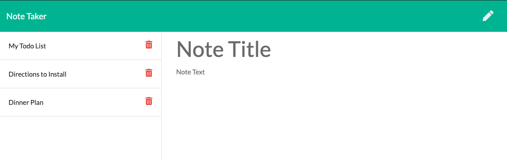

# Note-Taker_HS 
      
## Description
Use this application to write, save and delete notes. This application features Node.js with Express and backend code to read and write JSON files. 
https://hannahs-notetaker.herokuapp.com/ 
https://github.com/HannahStarcevich/Note-Taker_HS 

## Table of Contents
* [Installation](#installation)
* [Usage](#usage)
* [Contributing](#contributing)
* [License](#license)
        
## Installation
Visit the live link to the site hosted on Heroku. There you can write, review or delete notes. If you would like to collaborate on this project please reach out to me and start by reviewing the GitHub repository. Thanks!

## Usage

        
## Contributing
HannahStarcevich

## License
[MIT](#https://choosealicense.com/licenses/mit/)